# Azure User List - Production-Ready Azure Function

Fetches users from Azure Active Directory using Microsoft Graph API and persists them to a SQL Server database via stored procedures. Built with clean architecture principles, full dependency injection, and comprehensive security hardening.

## 📋 Quick Links

- [Azure AD App Registration Setup](https://learn.microsoft.com/en-us/azure/active-directory/develop/howto-create-service-principal-portal#app-registration-app-objects-and-service-principals)
- [Microsoft Graph Authentication](https://learn.microsoft.com/en-us/graph/sdks/choose-authentication-providers?tabs=CS#client-credentials-provider)
- [Deploy Azure Functions](https://learn.microsoft.com/en-us/azure/azure-functions/functions-how-to-use-azure-function-app-settings?tabs=portal)
- [Architectural Guide](./docs/ARCHITECTURE_REFACTOR_GUIDE.md)

---

## 🏗️ Architecture

This project follows **clean architecture** principles with 4 distinct layers:

```
Functions (HTTP Entry Point)
    ↓
Services (Business Logic Orchestration)
    ↓
Infrastructure (Graph API + SQL Database)
    ↓
Core (Domain Models + Configuration)
```

**Key Features:**
- ✅ Full dependency injection (no static methods)
- ✅ Parameterized SQL queries (SQL injection prevention)
- ✅ Proper async/await throughout
- ✅ Centralized configuration with validation
- ✅ 100% testable (all interfaces mockable)
- ✅ Separation of concerns (Graph SDK isolated from business logic)

---

## 🔧 Project Structure

```
AzureEntra/
├── Core/
│   ├── Configuration/          # Configuration interfaces & implementation
│   ├── Constants/              # Field selectors, constants
│   └── Models/                 # Domain models (AzureEntraUser, QueryResult)
├── Infrastructure/
│   ├── Graph/                  # Graph API authentication & user fetching
│   ├── Persistence/            # Repository implementations (SQL Server & PostgreSQL)
│   ├── Utilities/              # Utility classes (retry policies, etc.)
│   └── Health/                 # Health check implementations
├── Services/
│   └── AzureEntraUserService.cs # Business logic orchestration
├── Functions/
│   ├── Http/
│   │   ├── HttpGetAzureEntraUsers.cs  # HTTP trigger entry point
│   │   └── HealthCheckFunction.cs     # Health check endpoint
│   └── Program.cs              # Dependency injection setup
└── AzureEntra.Functions.csproj
```

---

## 🚀 Getting Started

### Step 1: Azure AD Setup

#### 1.1 Register Application in Azure AD

Navigate to **Azure Active Directory**:

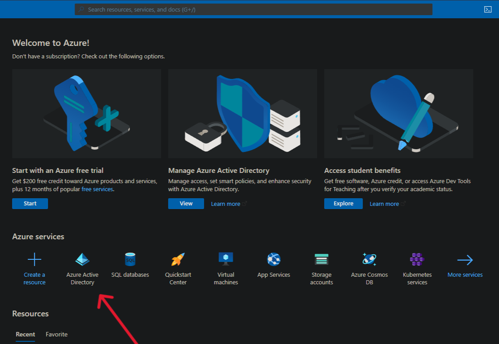

Click **New registration**:

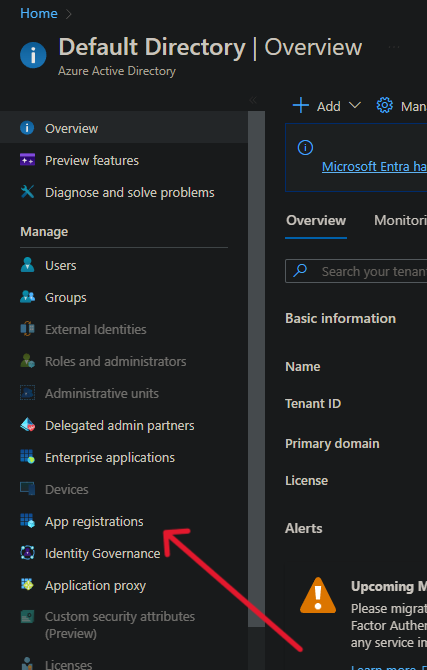

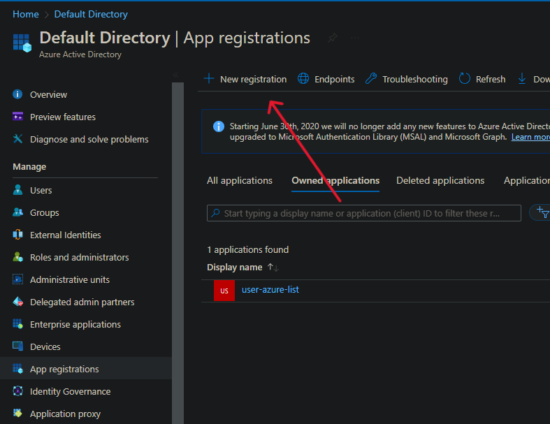

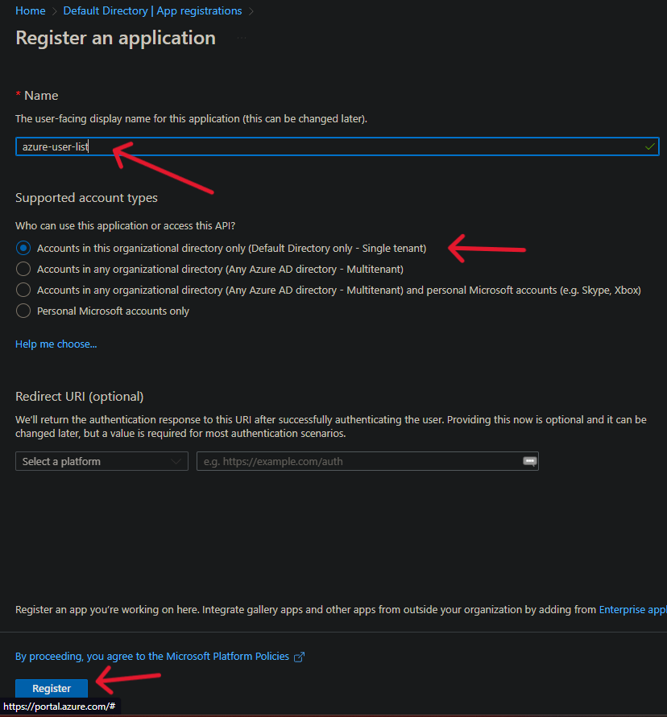

#### 1.2 Configure API Permissions

Click on your newly created application:

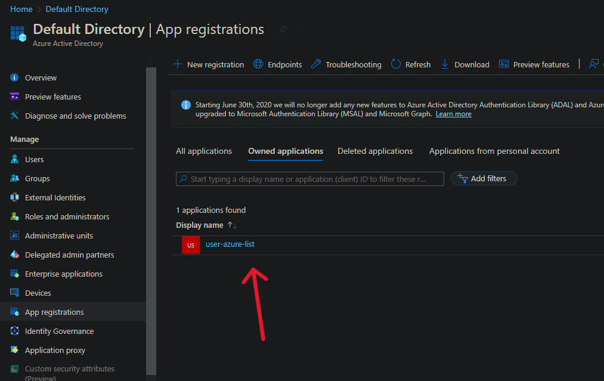

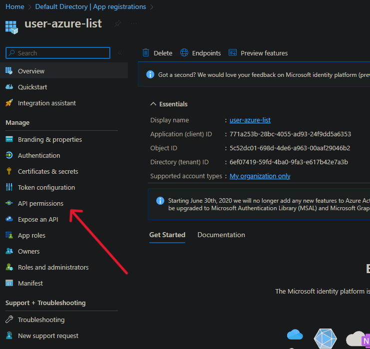

Add permissions for Microsoft Graph:

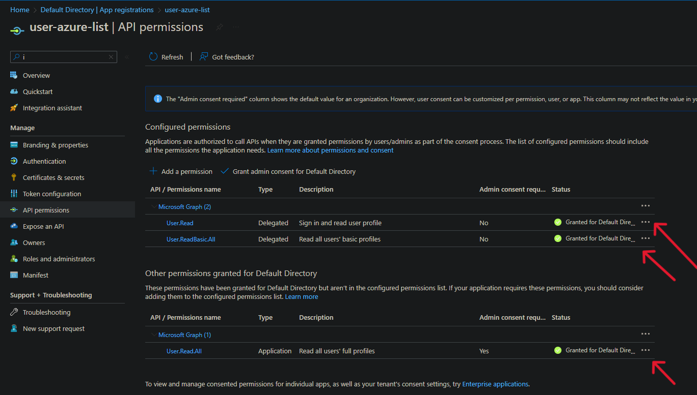

Click **Add a permission** → **Microsoft APIs** → **Microsoft Graph** → **Application permissions**

Search for "User" and select **User.Read.All** and **User.ReadBasic.All**:

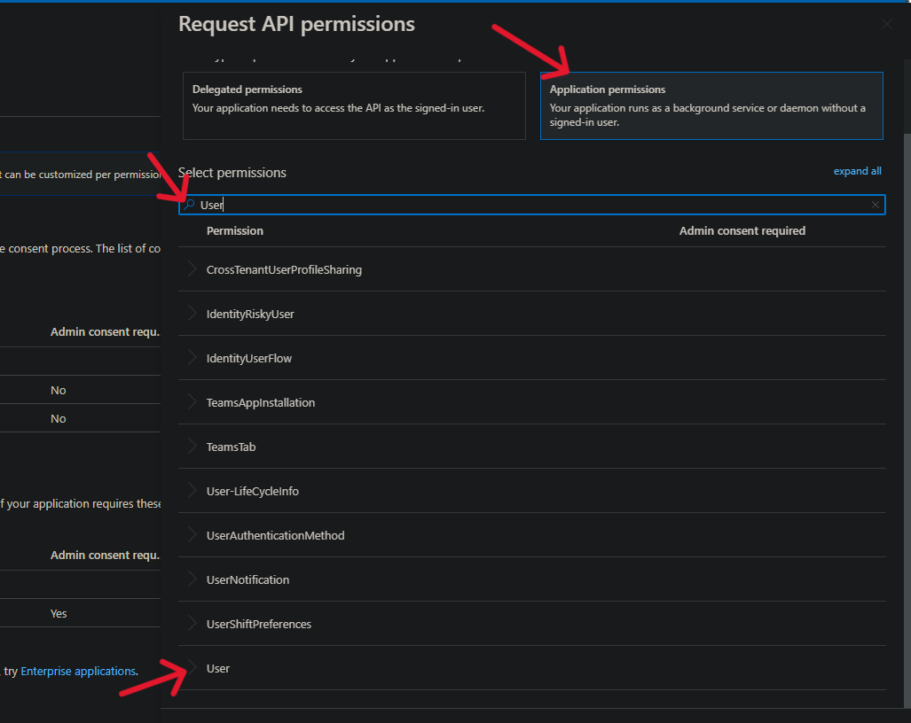

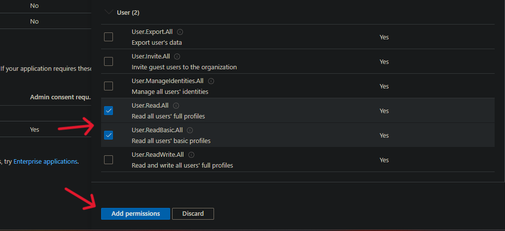

Also add **Delegated permissions** (search "User" → **User.Read** and **User.ReadBasic.All**):

Make sure to **Grant admin consent**:

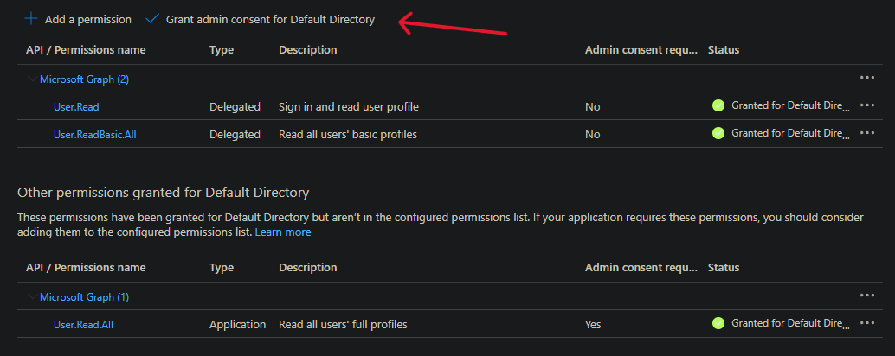

#### 1.3 Create Client Secret

Navigate to **Certificates & Secrets** and create a new client secret:

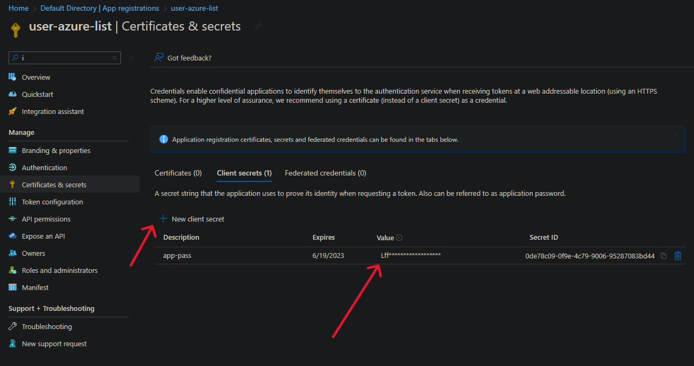

Copy the **Value** and save it securely.

Navigate back to **Overview** and copy both:
- **Application (client) ID**
- **Directory (tenant) ID**

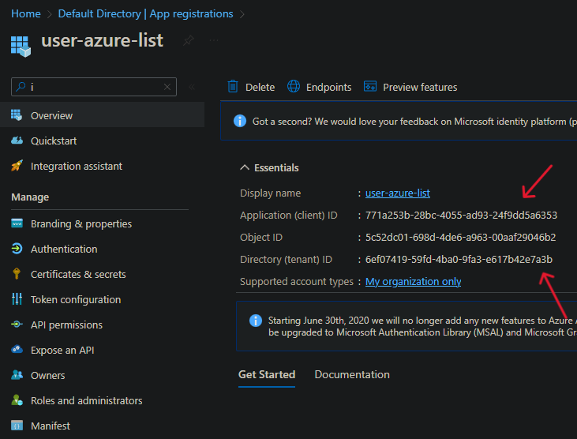

---

### Step 2: Local Development Setup

#### 2.1 Clone Repository

```bash
git clone https://github.com/omoinjm/azure-user-list.git
cd azure-user-list
```

#### 2.2 Configure Environment Variables

Copy the template:

```bash
cp local.settings.json.template local.settings.json
```

Edit `local.settings.json` and add your credentials:

For PostgreSQL:
```json
{
  "IsEncrypted": false,
  "Values": {
    "AzureWebJobsStorage": "UseDevelopmentStorage=true",
    "FUNCTIONS_WORKER_RUNTIME": "dotnet-isolated",
    "AZURE_TENANT_ID": "your-tenant-id",
    "AZURE_CLIENT_ID": "your-client-id",
    "AZURE_CLIENT_SECRET": "your-client-secret",
    "POSTGRESQL_CONNECTION_STRING": "Host=localhost;Database=your-db;Username=your-user;Password=your-password;",
    "DATABASE_PROVIDER": "PostgreSQL"
  }
}
```

For SQL Server:
```json
{
  "IsEncrypted": false,
  "Values": {
    "AzureWebJobsStorage": "UseDevelopmentStorage=true",
    "FUNCTIONS_WORKER_RUNTIME": "dotnet-isolated",
    "AZURE_TENANT_ID": "your-tenant-id",
    "AZURE_CLIENT_ID": "your-client-id",
    "AZURE_CLIENT_SECRET": "your-client-secret",
    "SQL_CONNECTION_STRING": "Server=your-server;Database=your-db;User Id=your-user;Password=your-password;",
    "DATABASE_PROVIDER": "SqlServer"
  }
}
```

#### 2.3 Install Dependencies

```bash
dotnet restore
```

#### 2.4 Build & Run Locally

```bash
dotnet build
dotnet run
```

The function will start on `http://localhost:7071`. Test with:

```bash
curl http://localhost:7071/api/users
```

---

### Step 3: Deploy to Azure

#### 3.1 Prerequisites

```bash
# Install Azure CLI
# https://learn.microsoft.com/en-us/cli/azure/install-azure-cli

az login
az account set --subscription "your-subscription-id"
```

#### 3.2 Create Resources

```bash
# Create resource group
az group create --name myResourceGroup --location eastus

# Create storage account (required by Azure Functions)
az storage account create \
  --name mystorageaccount \
  --resource-group myResourceGroup \
  --location eastus \
  --sku Standard_LRS

# Create Function App
az functionapp create \
  --resource-group myResourceGroup \
  --consumption-plan-location eastus \
  --name myFunctionApp \
  --storage-account mystorageaccount \
  --runtime dotnet-isolated \
  --runtime-version 8.0
```

#### 3.3 Configure Application Settings

For PostgreSQL:
```bash
az functionapp config appsettings set \
  --name myFunctionApp \
  --resource-group myResourceGroup \
  --settings \
    AZURE_TENANT_ID="your-tenant-id" \
    AZURE_CLIENT_ID="your-client-id" \
    AZURE_CLIENT_SECRET="your-client-secret" \
    POSTGRESQL_CONNECTION_STRING="your-postgresql-connection-string" \
    DATABASE_PROVIDER="PostgreSQL"
```

For SQL Server:
```bash
az functionapp config appsettings set \
  --name myFunctionApp \
  --resource-group myResourceGroup \
  --settings \
    AZURE_TENANT_ID="your-tenant-id" \
    AZURE_CLIENT_ID="your-client-id" \
    AZURE_CLIENT_SECRET="your-client-secret" \
    SQL_CONNECTION_STRING="your-sqlserver-connection-string" \
    DATABASE_PROVIDER="SqlServer"
```

#### 3.4 Deploy

```bash
func azure functionapp publish myFunctionApp
```

---

## 📊 Data Flow

```
Client (HTTP GET /api/users)
    ↓
HttpGetAzureEntraUsers (DI resolves dependencies)
    ↓
AzureEntraUserService (business logic)
    ├─→ IGraphAuthenticator (gets auth token)
    ├─→ IAzureEntraUserFetcher (fetches from Graph API with retry/pagination)
    └─→ ISqlAzureUserRepository (persists to SQL Server)
    ↓
Response (SyncResult: success/error, count, details)

Health Check Flow:
Client (HTTP GET /api/health)
    ↓
HealthCheckFunction
    ↓
AzureADHealthCheck
    ↓
Response (Health status)
```

---

## 🔒 Security Features

- ✅ **Parameterized SQL Queries** - Prevents SQL injection
- ✅ **Client Secret Credential** - Azure.Identity for secure authentication
- ✅ **No Credential Logging** - All secrets filtered from logs
- ✅ **Function-Level Authorization** - Restrict by IP/auth
- ✅ **Centralized Config Validation** - Fails fast if credentials missing
- ✅ **Async/Await Throughout** - No blocking operations
- ✅ **Dependency Injection** - Reduces attack surface by controlling object creation
- ✅ **Health Checks** - Monitor service availability and connectivity
- ✅ **EF Core Migrations** - Safe schema updates and versioning

---

## 🧪 Testing

Unit tests are included in the Services.UnitTests project. To run tests:

```bash
# Run all tests
dotnet test

# Run tests with coverage
dotnet test --collect:"XPlat Code Coverage"

# Run specific test project
dotnet test src/Services.UnitTests/Services.UnitTests.csproj
```

The project includes:
- Unit tests for service layer logic
- Mock implementations for external dependencies
- Integration patterns for Graph API and database operations

## 🛠️ Entity Framework Core Migrations

The project uses Entity Framework Core for database management. To manage migrations:

### Using Migration Scripts (Recommended)

The project includes convenient scripts for managing migrations:

```bash
# Create a new migration for PostgreSQL
./scripts/generate-migration.sh MyMigrationName PostgreSQL

# Create a new migration for SQL Server
./scripts/generate-migration.sh MyMigrationName SqlServer

# Apply migrations to development environment
./scripts/apply-migration.sh Development PostgreSQL

# Apply migrations to production (with confirmation)
./scripts/apply-migration.sh Production PostgreSQL
```

### Manual Migration Commands

Alternatively, you can use manual EF Core commands:

```bash
# Add a new migration
dotnet ef migrations add InitialCreate --project src/Infrastructure --startup-project src/AzureEntra.Functions

# For PostgreSQL
dotnet ef migrations add MigrationName --project src/Infrastructure --startup-project src/AzureEntra.Functions --context PostgreSqlAzureEntraDbContext

# For SQL Server
dotnet ef migrations add MigrationName --project src/Infrastructure --startup-project src/AzureEntra.Functions --context SqlServerAzureEntraDbContext
```

### Applying Migrations

```bash
# Apply migrations to the database
dotnet ef database update --project src/Infrastructure --startup-project src/AzureEntra.Functions
```

### Removing Migrations

```bash
# Remove the last migration
dotnet ef migrations remove --project src/Infrastructure --startup-project src/AzureEntra.Functions
```

The EF Core implementation automatically applies pending migrations when the service runs with the EF Core option enabled.

---

## 📚 Documentation

- **[ARCHITECTURE_REFACTOR_GUIDE.md](./docs/ARCHITECTURE_REFACTOR_GUIDE.md)** - Complete architectural guide with code examples
- **[UNIT_TEST_EXAMPLES.md](./docs/UNIT_TEST_EXAMPLES.md)** - Test patterns and mock examples
- **[CLEANUP_SUMMARY.md](./docs/CLEANUP_SUMMARY.md)** - What changed from original

---

## 🛠️ Configuration

All configuration is managed via **AzureEntraConfiguration.cs** and validated at startup:

| Variable | Required | Description |
|----------|----------|-------------|
| `AZURE_TENANT_ID` | Yes | Azure AD tenant ID |
| `AZURE_CLIENT_ID` | Yes | Application (client) ID |
| `AZURE_CLIENT_SECRET` | Yes | Client secret value |
| `SQL_CONNECTION_STRING` | No | SQL Server connection string (required if using SqlServer provider) |
| `POSTGRESQL_CONNECTION_STRING` | No | PostgreSQL connection string (required if using PostgreSQL provider) |
| `DATABASE_PROVIDER` | No | Database provider to use (PostgreSQL or SqlServer, defaults to PostgreSQL) |

Missing configuration throws `InvalidOperationException` on function startup.

---

## 📦 Dependencies

| Package | Version | Purpose |
|---------|---------|---------|
| Microsoft.Graph | 5.102.0 | Azure AD user fetching |
| Azure.Identity | 1.17.1 | Secure credential handling |
| Microsoft.Data.SqlClient | 5.2.2 | SQL Server database access |
| Npgsql | 8.0.3 | PostgreSQL database access |
| Npgsql.EntityFrameworkCore.PostgreSQL | 8.0.4 | PostgreSQL EF Core provider |
| Microsoft.EntityFrameworkCore.SqlServer | 8.0.8 | SQL Server EF Core provider |
| Microsoft.EntityFrameworkCore.Tools | 8.0.8 | EF Core command-line tools |
| Microsoft.EntityFrameworkCore.Design | 8.0.8 | EF Core design-time tools |
| Microsoft.Azure.Functions.Worker | 2.51.0 | Azure Functions runtime |
| Microsoft.Extensions.* | 9.0.0 | Dependency injection and configuration |
| Newtonsoft.Json | 13.0.3 | JSON serialization |

---

## 🚦 API Reference

### GET `/api/users`

**Request:**
```http
GET /api/users HTTP/1.1
Host: myFunctionApp.azurewebsites.net
```

**Request with EF Core:**
```http
GET /api/users?useEfCore=true HTTP/1.1
Host: myFunctionApp.azurewebsites.net
```

**Response (200 OK):**
```json
{
  "success": true,
  "message": "Successfully synchronized 42 users.",
  "data": {
    "userCount": 42,
    "rowsAffected": 42,
    "executionTimeMs": 1234.5,
    "persistenceMethod": "Direct Provider"
  }
}
```

**Response with EF Core (200 OK):**
```json
{
  "success": true,
  "message": "Successfully synchronized 42 users.",
  "data": {
    "userCount": 42,
    "rowsAffected": 42,
    "executionTimeMs": 1234.5,
    "persistenceMethod": "EF Core"
  }
}
```

**Response (400 Bad Request):**
```json
{
  "success": false,
  "error": "Configuration error",
  "message": "Environment variable 'AZURE_TENANT_ID' is not configured. Please set it before running the function."
}
```

### GET `/api/health`

**Request:**
```http
GET /api/health HTTP/1.1
Host: myFunctionApp.azurewebsites.net
```

**Response (200 OK):**
```json
{
  "status": "Healthy",
  "totalDuration": "00:00:00.1234567",
  "entries": {
    "azureadconnectivity": {
      "status": "Healthy",
      "description": "Azure AD connectivity is healthy.",
      "duration": "00:00:00.1234567"
    }
  }
}
```

**Response (503 Service Unavailable):**
```json
{
  "status": "Unhealthy",
  "totalDuration": "00:00:00.1234567",
  "entries": {
    "azureadconnectivity": {
      "status": "Unhealthy",
      "description": "Azure AD connectivity is unhealthy.",
      "duration": "00:00:00.1234567"
    }
  }
}
```

---

## 🆘 Troubleshooting

**"Invalid credentials" error:**
- Verify `AZURE_TENANT_ID`, `AZURE_CLIENT_ID`, `AZURE_CLIENT_SECRET` are correct
- Check that client secret hasn't expired in Azure AD

**"Connection timeout" to SQL Server:**
- Verify SQL Server firewall allows Azure Function's IP
- Check `SQL_CONNECTION_STRING` is correct
- Verify stored procedure exists in database

**"Dependency injection error":**
- Ensure all services are registered in Program.cs
- Check that interfaces match implementations
- Verify project references are correctly set up

**"PostgreSQL connection error":**
- Verify PostgreSQL server is accessible
- Check that POSTGRESQL_CONNECTION_STRING is properly formatted
- Ensure PostgreSQL database and user have proper permissions
- Confirm that Npgsql package is correctly referenced

**"Database provider configuration error":**
- Verify DATABASE_PROVIDER is set to either "PostgreSQL" or "SqlServer"
- Ensure the corresponding connection string is provided
- Check that the required database is running and accessible

**"User.Read.All permission not granted":**
- Ensure you clicked "Grant admin consent" in Azure AD
- Admin must approve permissions before first use

---

## 📄 License

See [LICENSE](./LICENSE) file.

---

## 🤝 Contributing

This project is production-ready. For changes:
1. Follow the existing architecture patterns
2. Add tests for new functionality
3. Verify async/await compliance
4. Use parameterized SQL queries

---

**Last Updated:** January 2026 | **Status:** Production Ready ✅
