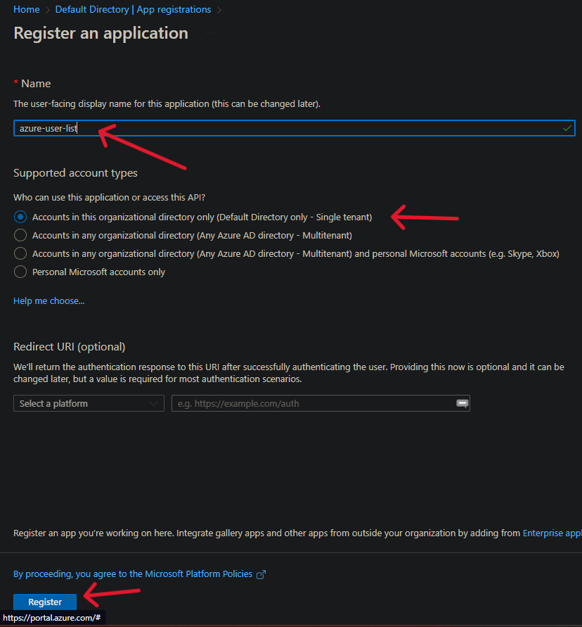
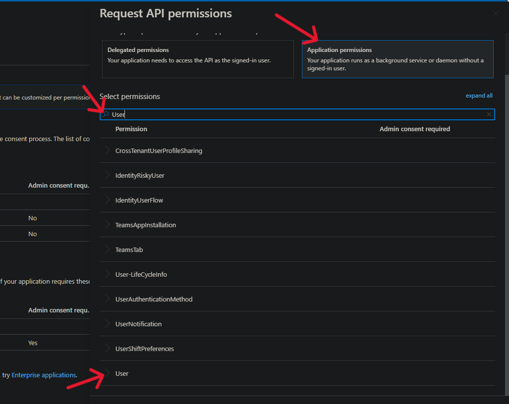

# Get list of users on Azure Active Directory using Microsoft Graph API

Documentation Links:
  - [Application Portal setup](https://learn.microsoft.com/en-us/azure/active-directory/develop/howto-create-service-principal-portal#app-registration-app-objects-and-service-principals)
  - [Azure.Identity](https://learn.microsoft.com/en-us/graph/sdks/choose-authentication-providers?tabs=CS#client-credentials-provider)
  - [Create Console App](https://learn.microsoft.com/en-us/azure/azure-functions/functions-how-to-use-azure-function-app-settings?tabs=portal)

1. Obtain a valid authentication token:
  
  - Navigate to `Azure Active Directory`
    
     
 
  - Create a new `App registration`

    

    

    

  - Add `API Permissions` for the Graph resources you'd like to access
    
    - Click on the newly created application

      

      

    - Add the following permissions

      

    - Click on `Add a permission`

    - Navigate to `Microsoft APIs` -> `Microsoft Graph` -> `Application permissions`

    - Search for `User`

      

    - Click `User.Read.All` and `User.ReadBasic.All`
            
      

    - Navigate to `Microsoft APIs` -> `Microsoft Graph` -> `Delegate permissions`

    - Search `User`

    - Click on `User.Read` and `User.ReadBasic.All` -> `Add Permission`
           
    - Make sure to click `Grant admin consent`

      

2. Creating application

  - Navigate to `Certificates & Secrets` and create a `New client secrets`

  - Copy the `Value` and paste it into notepad

    

  - Go back to `Overview`

  - Copy `Application (client) ID` as well as `Directory (tenant) ID` and paste them into notepad

     

  - Go to this GitHub repository to find the code: `https://github.com/omoinjm/azure-user-list`

    OR

  - Create new Console Application:
    
    ```bash
    dotnet new console
    ```

  - Install the following packages:
    
    ```bash
    dotnet add package DotNetEnv

    dotnet add package Microsoft.Graph.Auth --version 1.0.0-preview.7

    dotnet add package Microsoft.Graph

    dotnet add package Microsoft.Identity.Client
    ```
  - Insert code in Program.cs

    

  - Insert Environment Variables

    
    
